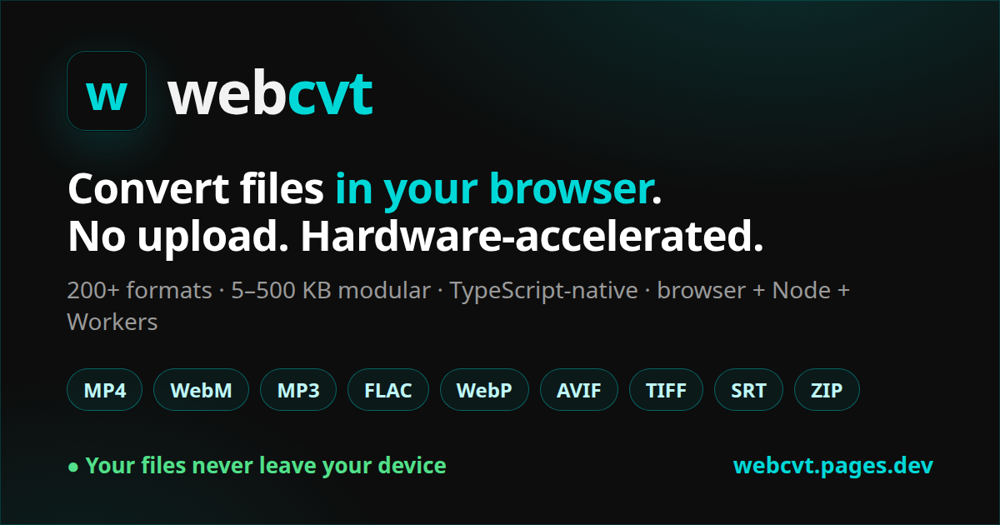

# webcvt

> Browser-first, hardware-accelerated file conversion library. Convert anything in the browser, no upload required.

[](https://github.com/Junhui20/webcvt/actions/workflows/ci.yml)
[](https://www.npmjs.com/package/@catlabtech/webcvt-core)
[](./LICENSE)




## Status

🚧 **Pre-release** — feature-complete and in launch prep. The v0.1.0 npm publish is the remaining step, so packages aren't on npm yet; APIs may still change before then.

- **27 packages** shipped across Phases 1–6 (`@catlabtech/webcvt-core` + 11 image/codec, 9 container, 2 data/subtitle, 1 CLI, 3 ancillary)
- **4,477 tests** passing; CI green
- Phase 3 (core containers, second-pass Minus): **complete** — classic + fragmented MP4, multi-track, avc/hevc/vp9/av1 video, edit lists, iTunes metadata
- Phase 4 (image, animation, archive, data-text): **complete** (5/5)
- Phase 4.5 (deferred-format roll-up): **11 shipped** — image: TIFF, TGA, XBM, PCX, XPM, ICNS; data-text: JSONL, TOML, FWF, XML, YAML
- Phase 5 (launch prep): `@catlabtech/webcvt-cli`, `@catlabtech/webcvt-backend-wasm`, `apps/playground`, `apps/docs`, and the `examples/` are all shipped — **the v0.1.0 npm publish is the only remaining step**

See [`plan.md`](./plan.md) for the full project plan,
[`CHANGELOG.md`](./CHANGELOG.md) for release notes, and
[`CONTRIBUTING.md`](./CONTRIBUTING.md) for how to contribute or resume work.

Try the live demo: **[webcvt.pages.dev](https://webcvt.pages.dev)** — drag a file, pick a format, download in-browser.

## What is it

A modular TypeScript library that converts files **in the browser**, using
WebCodecs for hardware acceleration and `ffmpeg.wasm` only as a legacy
fallback. Same code runs in Node.js and Cloudflare Workers.

Target: match Transmute.sh's 200+ formats and 2,000+ conversion pairs, but
as a tree-shakable browser library instead of a Docker server.

### Browser requirements

- Pure-JS/Canvas conversions (most images, subtitles, data-text, archives) work
  in any modern browser with no special setup.
- Hardware-accelerated audio/video paths use **WebCodecs** where available.
- WASM backends that use threads / `SharedArrayBuffer` require the page to be
  **cross-origin isolated** — serve it with `Cross-Origin-Opener-Policy: same-origin`
  and `Cross-Origin-Embedder-Policy: require-corp` (see the playground's
  [`_headers`](./apps/playground/public/_headers)).

## Competitive positioning

| | ffmpeg.wasm | Transmute | Mediabunny | **webcvt** |
|---|---|---|---|---|
| Mode | browser | server (Docker) | browser | **browser-first** |
| Bundle | 30 MB | N/A | ~50 KB | **5–500 KB (modular)** |
| HW accel | ❌ | ✅ native | ✅ | **✅** |
| TS-native | ⚠️ | ❌ | ✅ | **✅** |
| Modular | ❌ | ❌ | ⚠️ | **✅** |
| Scope | AV only | 200+ formats | AV only | **200+ formats** |

## Packages

Live list grows as Phases complete. See [plan.md §3](./plan.md) for the full roadmap.

### Foundation

- `@catlabtech/webcvt-core` — public API, types, format detector, backend registry, capability probe
- `@catlabtech/webcvt-codec-webcodecs` — hardware-accelerated encode/decode adapter
- `@catlabtech/webcvt-test-utils` — shared test fixtures + byte helpers
- `@catlabtech/webcvt-backend-wasm` — ffmpeg.wasm fallback (lazy-loaded; ~203 MIME pairs)

### Audio + video containers

- `@catlabtech/webcvt-container-wav` — RIFF/WAV
- `@catlabtech/webcvt-container-mp3` — MPEG-1/2/2.5 Layer III + ID3v2/v1 + Xing/LAME
- `@catlabtech/webcvt-container-flac` — FLAC (native)
- `@catlabtech/webcvt-container-ogg` — Ogg (Vorbis, Opus)
- `@catlabtech/webcvt-container-aac` — AAC ADTS
- `@catlabtech/webcvt-container-mp4` — M4A / MP4 (classic + fragmented; multi-track; avc1/avc3/hev1/hvc1/vp09/av01 video + AAC audio; edit lists + iTunes metadata)
- `@catlabtech/webcvt-container-webm` — WebM (VP8/VP9 + Opus/Vorbis)
- `@catlabtech/webcvt-container-mkv` — Matroska (AVC/HEVC/VP9 + AAC/FLAC/Opus/Vorbis)
- `@catlabtech/webcvt-container-ts` — MPEG-TS / HLS (H.264 + AAC ADTS)
- `@catlabtech/webcvt-ebml` — shared EBML primitives (RFC 8794)

### Images

- `@catlabtech/webcvt-image-canvas` — PNG/JPG/WebP/BMP/ICO via Canvas API
- `@catlabtech/webcvt-image-svg` — SVG parse + Canvas rasterize (with aggressive security gates)
- `@catlabtech/webcvt-image-animation` — GIF + APNG + animated WebP
- `@catlabtech/webcvt-image-legacy` — PBM/PGM/PPM/PFM/QOI + TIFF + TGA + XBM + PCX + XPM + ICNS
- `@catlabtech/webcvt-image-jsquash-avif` — AVIF encode/decode via `@jsquash/avif` (libavif WASM)
- `@catlabtech/webcvt-image-jsquash-jxl` — JPEG XL encode/decode via `@jsquash/jxl` (libjxl WASM, royalty-free)
- `@catlabtech/webcvt-image-jsquash-mozjpeg` — smaller JPEGs via `@jsquash/jpeg` (MozJPEG WASM)
- `@catlabtech/webcvt-image-jsquash-oxipng` — lossless PNG optimise via `@jsquash/oxipng` (OxiPNG WASM)
- `@catlabtech/webcvt-image-heic` — HEIC/HEIF decode (iPhone photos → PNG/JPG/WebP) via `libheif-js` (libheif WASM)
- `@catlabtech/webcvt-image-pdf` — wrap an image into a one-page PDF (clean-room writer, zero deps)

### Archives + data + subtitles

- `@catlabtech/webcvt-archive-zip` — ZIP + POSIX ustar TAR + gzip
- `@catlabtech/webcvt-data-text` — JSON + JSONL + CSV + TSV + INI + ENV + TOML + FWF + XML + YAML
- `@catlabtech/webcvt-subtitle` — SRT/VTT/ASS/SSA/SUB/MPL

### CLI

- `@catlabtech/webcvt-cli` — `npx webcvt in out` Node CLI with optional-dep backend loader

### Planned

See [plan.md §6 Roadmap](./plan.md) — 9 Phases over ~9 months. Phase 6 modern-codec
work has already landed on `main`: AVIF & JPEG XL (encode + decode), HEIC/HEIF
decode (iPhone photos), MozJPEG / OxiPNG optimisers, and image→PDF. Next up is the
**v0.1.0 npm release**; further codecs and HEIC/AVIF tuning follow in v0.2+.

## Quickstart

### Install

Install only the packages you need — the browser bundle stays in the 5–500 KB
range instead of ffmpeg.wasm's ~30 MB.

```bash
# Images in the browser:
npm install @catlabtech/webcvt-core @catlabtech/webcvt-image-canvas
# …or just MP3:
npm install @catlabtech/webcvt-core @catlabtech/webcvt-container-mp3
```

> Pre-release: packages publish to npm with the v0.1.0 release. Until then, use
> the workspace from a clone (see [Development](#development)) or the live demo.

See the full [supported-formats matrix](./docs/supported-formats.md).

### Try it in the browser
[`apps/playground`](./apps/playground) — drag-drop any supported file,
pick a target format, download the result. Zero network requests. Or use the
hosted demo at **[webcvt.pages.dev](https://webcvt.pages.dev)**.

### Use it in Node.js

```typescript
// Low-level parse/serialize API (text formats — no setup needed)
import { parseSrt, serializeVtt } from '@catlabtech/webcvt-subtitle';
const vtt = serializeVtt(parseSrt(srtString));
```

```typescript
// High-level convert() API (binary formats — browser or Node)
import { convert, defaultRegistry } from '@catlabtech/webcvt-core';
import { CanvasBackend } from '@catlabtech/webcvt-image-canvas';
defaultRegistry.register(new CanvasBackend());
const result = await convert(pngBlob, { format: 'webp' });
```

Working examples in [`examples/`](./examples/).

## Development

```bash
pnpm install
pnpm build        # build all packages
pnpm test         # run all tests
pnpm typecheck
pnpm lint
```

## Contributing

See [CONTRIBUTING.md](./CONTRIBUTING.md). Every package follows the same
TDD + code-review + security-review pipeline.

## License

MIT © 2026 webcvt contributors.
